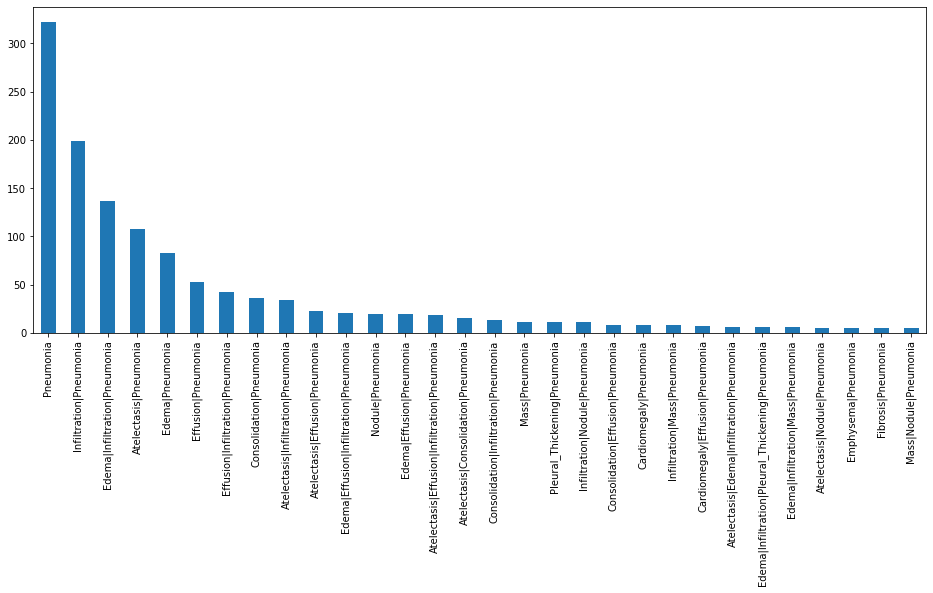
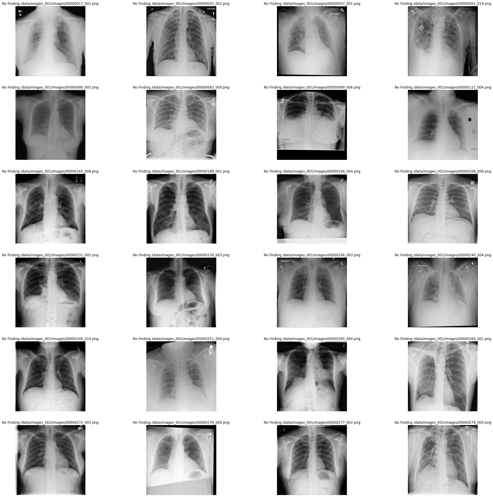
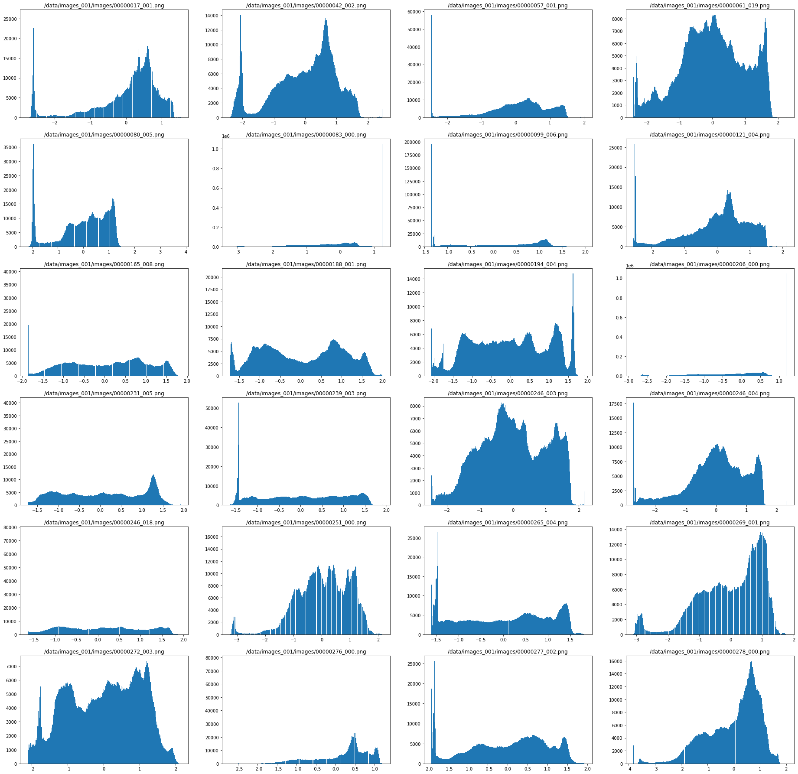
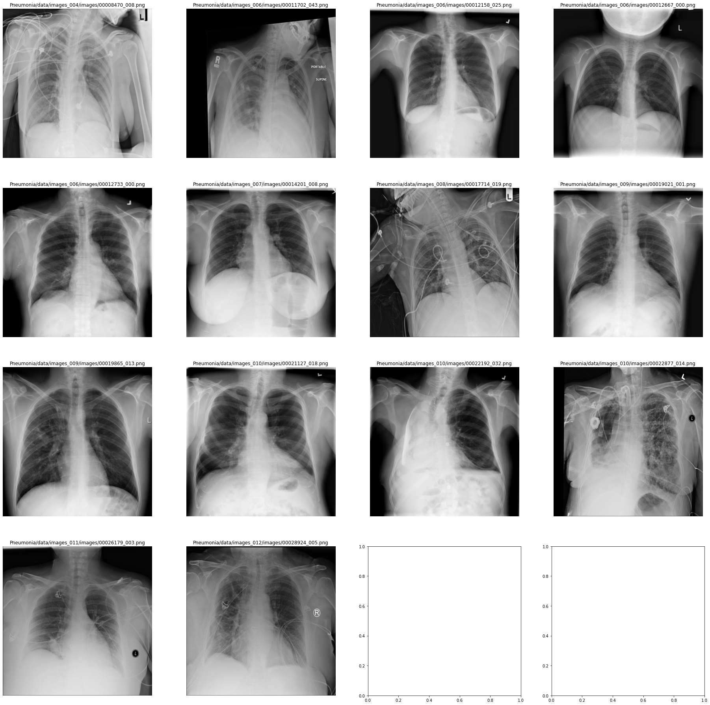
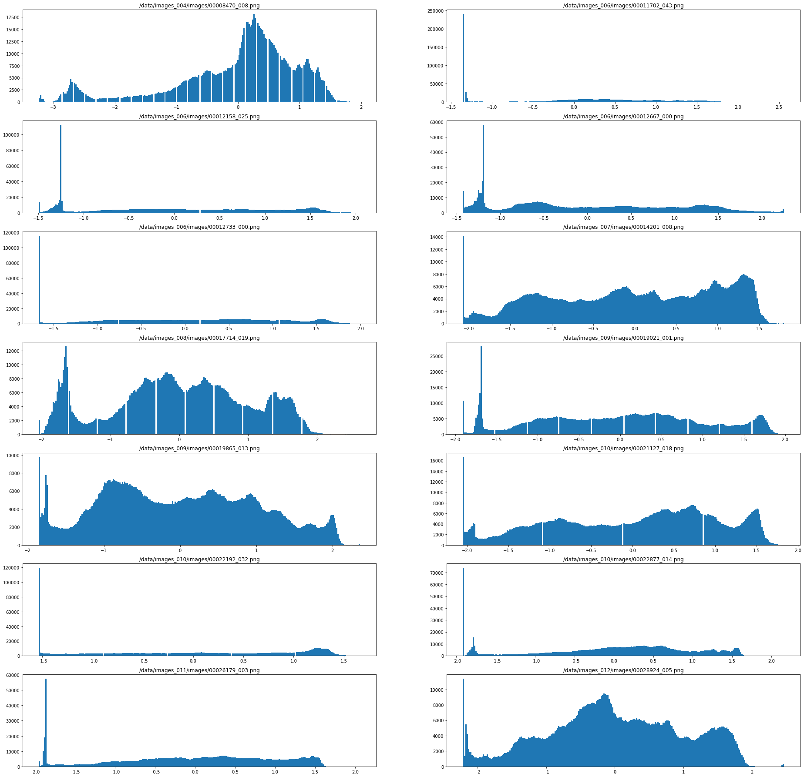

# Pneumonia_Detection
Fine-tune VGG16 CNN using Keras to detect and predict if chest xrays from NIH Kaggle Dataset are indicative of pneumonia. Dataset found here: https://www.kaggle.com/nih-chest-xrays/data

## Patient Demographic From Dataset ##

Our dataset consisted of male (63328) and female (48776) patients aged 1-95 years, with most patients falling in the range of 40-60 years old. Chest X-rays from both PA (Posterior Anterior) and AP (Anterior Posterior) views were taken.

### Co-Occuring Diseases ###
The following plot shows co-occuring diseases in x-rays that showed pneumonia was present in our dataset. It is important to understand if other diseases are present as they may affect the pixel-intensities of the chest x-ray taken.

### Pixel-Level Assessments of Imaging Data ###
The following images show what cases where the patient is healthy (No disease findings in chest xrays) and cases where pneumonia is present in the chest xrays. Accompanying the xray figures is a series of pixel intensities. 

#### Healthy Data (no pneumonia or other conditions) ####

#### Pneumonia Chest-Xrays ####

## Model Architecture ##

## Evaluation Metrics ##

### Precision ###

### Recall ###

### Threshold ###

### F1 Score ###

## 
